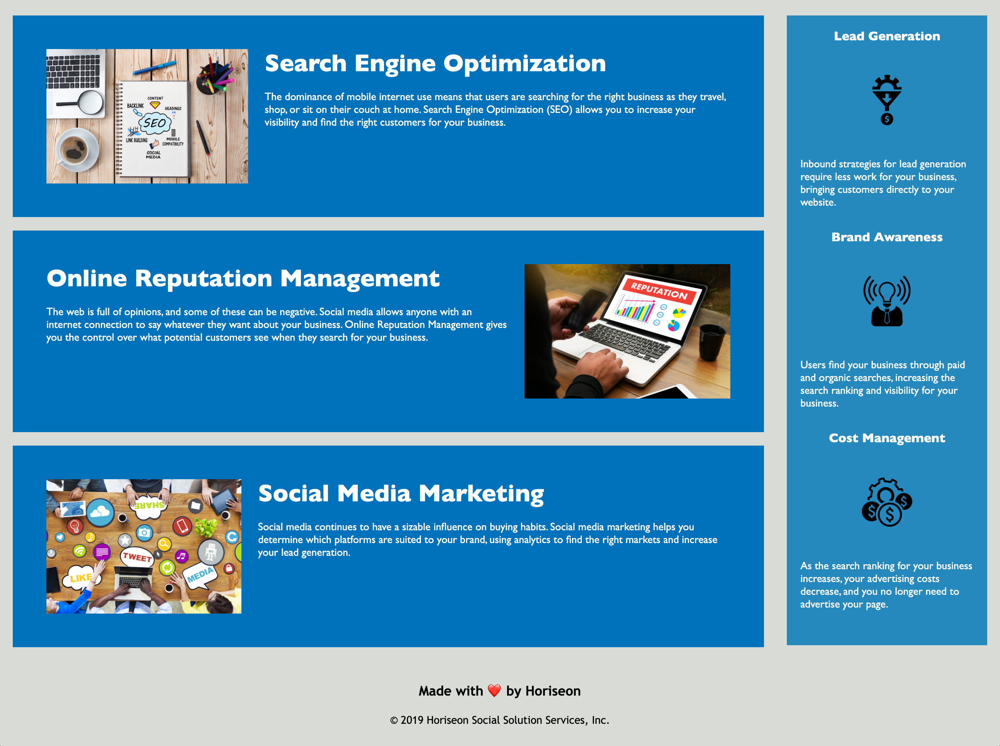

# horiseon-html-css-code-refractor
 
 ## Objective
 
 To modify, organize, and consolidate elements in both .html and .css files for Horiseon.
 
 ## Description 
 
 GitHub profile: https://github.com/mbostwick1
 Live URL: https://mbostwick1.github.io/horiseon-html-css-code-refractor/
 
 This project helped me clearly understand html semantic elements and why they are used. Using semantic elements helps clearly organize the html file so not only I can navigate through easily but also for other developers. 
 
 Adding alt tags to images is absolutely necessary for accessibility.
 
 A CSS document can quickly become messy. Consolidating the elements in this project with the same atributes not only improve readability but also increases efficiency/proficency when revisions must be made. 
 
 I also added commented sections for each semantic and organized in the same flow as the .html. This helps with readability.
 
 ## Screenshots

 
 

